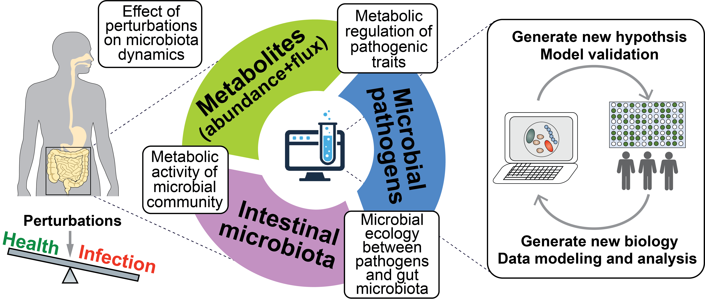

## Research overview:
The gut microbiota produces a diverse array of metabolites that contribute to various physiological processes and modulate the growth, differentiation, and function of host cells and other microbes. **The primary goal of my lab is to decipher the complex microbe-metabolite interactions within the human gut microbiome**. A mechanistic understanding of these interactions will aid in identifying potential therapeutic targets to promote gut health and prevent disease. To achieve this goal, my lab will employ a combination of computational modeling, microbiology experiments, and clinical data analysis to drive innovation and advance knowledge in metabolite-mediated microbe-microbe and host-microbe interactions.

## Direction 1: Metabolic modeling of gut microbiome

__We aim to develop noval computational models (e.g., constraint-based models and machine learning models) to predict metabolic phenotypes (e.g., uptake and secretion of metabolites) of gut bacteria at both cellular and community levels__. In particular, we are interested in short-chain fatty acids (SCFAs), which are the main metabolites produced in the colon by bacterial fermentation of dietary fibers and resistant starch. I previously used generalized Lotka-Volterra model to infer bacterial taxa involved in the ecological process of SCFA production from mouse fecal microbiome data [Liu and Liao et al., 2022. The ISME Journal](https://academic.oup.com/ismej/article/16/8/2040/7474293).

__Multiple projects are immediately available in my lab__. At the cellular level, we are interested in the metabolic regulation of SCFA production. We ask how bacterial cells choose among alternative pathways under given nutrient conditions. For accurate prediction of SCFA concentration, what is the best computational model and the minimal input data? Is a dynamic flux balance model (knowledge-driven) or a machine learning model (data-driven) better? Can we develop a hybrid approach that combines the two types of models (i.e., knowledge-driven machine learning models)? Is genomic sequencing data sufficient for SCFA prediction, or is transcriptomic/proteomic data essential?

At the community level, we are interested in the metabolic cross-feeding involved in SCFA production. Well known examples of cross-feeding includes primary fermenters breaking down complex polysaccharides into simpler sugars, which secondary fermenters then utilize to produce acetate, propionate, and butyrate. But what else? Can we detect cross-feeding interactions from microbiome multiomics data? I previously used a small-scale kinetic model to simulate cross-feeding between different *Escherichia coli* mutants [Liao et al., 2020. PLoS Computational Biology](https://journals.plos.org/ploscompbiol/article?id=10.1371/journal.pcbi.1008135). For complex gut bacterial community, we will expand this model and combine it with genome-scale metabolic annotation to reconstruct cross-feeding network from paired shotgun metagenomics and metabolomics data. A comparison of the reconstructed network between healthy individuals and patients (e.g., cystic fibrosis) will enable discovery of altered cross-feeding interactions in patients, which cannot be directly measured in experiments.

__Other projects along this line include spatial simulation of gut microbiome composition and host-microbiome interactions__. For spatial simulation, we will develop partial differential equation (PDE) models to infer the spatial distribution of gut bacteria, using observed fecal microbiota composition as the boundary condition. For host-microbiota interactions, we are particularly interested in tryptophan metabolism and the expression of IDO in the kynurenine pathway. Our preliminary data (in preparation) have shown that perturbation of the gut microbiota by antibiotics regulates host IDO gene expression in epithelial cells.

## Direction 2: Spectrometry-based fungal metabolomics

Accurate prediction of fate and transport of contaminants in the environment is a critical step in chemical risk assessment.I am interested in systematically predicting toxicity and understanding properties of interest using novel machine learning and deep learning models. Our work includes: 1) predict pesticide dissipation half-life intervals in plants using molecular fingerprints [Shen et al., 2022. Journal of Hazardous Materials](https://doi.org/10.1016/j.jhazmat.2022.129177); 2) predict chemical ecotoxicity by learning latent space chemical representations [Gao, ......, Shen*. 2022. Environment International](https://doi.org/10.1016/j.envint.2022.107224). 3) predict bioaccumulation of organic contaminants in plant roots from soils [Gao and Shen et al., 2022. Journal of Hazardous Materials](https://doi.org/10.1016/j.jhazmat.2021.127437); [Gao et al., 2021. Environmental Science & Technology](https://doi.org/10.1021/acs.est.1c02376); 

## Direciton 3: Metabolic regulation of antibiotic resistance
High dimensional data are becoming increasingly common in environmental and biomedical research (e.g., omics). While we obtain much more information from high-dimensional data, they may contain redundant information. Therefore, the ability to learn from high-dimensional data is challenging. We developed a deep learning autoencoder survival analysis model – AESurv to assist accurate early prediction of coronary heart disease from high dimensional epigenomics data [Shen et al., manuscript in prepration](). Future works include integrating metagenomics, metatranscriptomics, exposomics, etc. 
